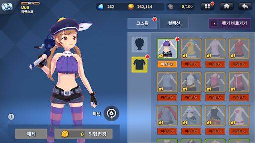

### 1. [[컨셉]](#컨셉)
### 2. [[관련이미지 & 동영상]](#관련이미지--동영상)
### 3. [[대표이미지]](#대표이미지)
### 4. [[<으왈컹>의 구성요소]](#으왈컹의-구성요소)  
### 5. [[게임 시스템 디자인]](#게임-시스템-디자인)

### [1주차 개발 진행 상황](files/W01)

# [컨셉]
## 메인컨셉 : 스토리(story)
- 육성 시뮬레이션
- 스토리 위주의 게임
- 예지몽을 꾼 주인공이 왕국과 포로가 될 언니를 전쟁으로부터 구하는 스토리

## 서브컨셉1 : 판타지(fantasy)
- 현실에서 일어날 수 없는 마법, 변신 이라는 요소를 사용
- 동물이 인간으로 변신

## 서브컨셉2 : 관계성(relationship)
- 게임 진행 도중 만나는 NPC들과 관계성을 쌓아 능력치를 얻음

## 서브컨셉3 : 성장
- 선택을 통해 경험을 쌓아 주인공이 성장

## 서브컨셉4 : 다양함
- 주인공의 모습의 변화에 따라 여러가지 상황에 다양한 방법으로 게임 진행 가능
- 같은 엔딩 방식(bad, happy)이더라도 여러가지 다른 상황의 엔딩 스토리가 존재

## 서브컨셉5 : 전략
- 선택하는 변신폼에 따라 이벤트 결과가 달라짐
- 일정 분기 전에 올린 능력치에 따라 엔딩 조건이 갈림
  
  

# [관련이미지 & 동영상]
## <이미지>

## <동영상>
- 관련 다른 게임
(https://www.youtube.com/watch?time_continue=1&v=QSSJmJLB4gI&feature=emb_title)
  
  

# [대표이미지]
- 메인화면

 

- 스케쥴화면

 

- 선택창화면

 

- 엔딩모음화면

 
  
  

# [<으왈컹>의 구성요소]
## <스토리>
#### 주인공은 개 왕국의 공주님. 마법 능력을 가지고 태어남.
#### 그러나 마법 능력이 점점 약해져 평범한 사람과 같아짐.
 

#### 어느날 보물창고에서 이상하게 끌리는 보석을 발견하고 그것을 만졌는데 빛이 쏟아져나옴. 그리고 마력이 돌아온 것을 느낌.
#### 그날 밤 주인공은 꿈을 꾸게 되는데, 1년 후 이웃나라와의 전쟁으로 왕국이 패배하는 꿈이었음. 설상가상으로 사랑하는 언니가 포로로 잡혀감.
 

#### 꿈에서 꺤 주인공은 이것이 예지몽임을 깨닫고 이 사실을 모두에게 알리려고 시도함.
#### 하지만 관련된 말을 꺼내려고만 하면 목소리가 나오지 않아 실패함.
 

#### 도움을 받을 수 없다는 것을 받아들인 주인공은 자신의 힘으로 왕국과 포로가 된 언니를 전쟁으로부터 구하기로 결심함.
  

## <메커니즘>
#### 주인공은 매주 기술을 올려주는 수업을 들어야 함.
#### 주인공이 배운 기술들에 따라, 게임을 진행하는 동안 나오는 선택지가 변함.
#### 어떤 기술을 배우냐에 따라 볼 수 없는 이벤트도 있음.
 

#### 수업을 하면 스트레스가 일정치 쌓임.
#### 스트레스 수치가 일정수준 이상 올라가면 캐릭터가 수업을 제대로 수행할 수 없음.
#### 스트레스 관리에 주의!
 

#### npc 호감도는 주인공이 배울 기술이나 이벤트에 영향을 줌.
#### npc에 따라 기술을 배울 때 주는 보너스나 페널티가 바뀜.
#### 친해진 npc에 따라 열리는 선택지가 있음.
 

#### 기술목록 -> ( 개 능력 / 신체 능력 / 마법 능력 / 지식 / 신성력 )
#### 일주일에 2개의 기술을 배울 수 있음. 주말을 제외한 하루마다 배우려 하는 기술을 10포인트씩 획득.(제한 1000)
 

#### 주말에는 마을에 방문해서 npc의 호감도를 올리거나 능력치를 올릴 수 있음.
#### 특정 주차에는 숨겨진 이벤트 스토리를 볼 수도 있음. / 토,일 오전오후 4번
 

#### 이야기를 진행하면서, 시스템 안내메세지창이 왼쪽 상단에 나타날 때가 있음.
#### 이 안내메세지들은 장면 이면에 무슨 일이 일어나는지 알려줌.(능력치 or 호감도 수치의 변화)
 

#### 또 다른 메세지는 플레이어가 이전에 배운 기술에 의해 이야기가 바뀔 때 보이게 됨.
#### 만약 실패했다는 메세지가 나오면, 해당 기술이 요구 수치에 못 미쳤기 때문에 숨겨진 선택지를 지나치게 된다는 뜻.
#### 예를 들어 산책을 하고 있었는데 도둑을 발견함 -> 경비병에게 신고한다, 도망친다, (쫓아간다) <- 숨겨진 선택지
#### [민첩성 < 30이면 안내창에 민첩성 -> 실패 라는 메세지가 뜸] 
 

#### 이러한 메세지들은 숨겨진 다른 선택지들을 알아내고 다음 회차 플레이에 도움을 줄 수 있음.
  

## <미적요소>
### <디자인>
- #### 능력치가 일정치에 도달하면 해당 능력치에 관련된 의상이 오픈
 

### <음향>
- #### 시스템 메세지가 뜰 때 알림음이 출력됨
- #### 장소에 바뀌거나 이벤트가 발생할 때 BGM이 바뀜
- #### 엔딩의 종류에 따라서 BGM이 바뀜
 

# [게임 시스템 디자인]

## [게임 오브젝트 분리]

|연번|오브젝트 이름|오브젝트 이미지|  
|-----:|:-----:|-----|  
|1|플레이어 캐릭터||  
|2|마을||  
|3|아이템||  
|4|선택지||  
|5|스케쥴||  

## [파라미터 뽑아보기]

### (1) 플레이어 캐릭터
 

|속성|속성값|설명|비고|
|-----|-----|-----|-----|
|이름|시트린|주인공 캐릭터|
|나이|15||
|스트레스|0~100|캐릭터의 건강에 관련된 스탯. 스트레스가 너무 높으면 게임 진행에 문제가 생김|스케쥴을 수행하면 스트레스+n 스트레스가 n2 이상 쌓이면 스케쥴 수행 불가|
|능력치|0~1000|[ 개 능력 / 신체 능력 / 마법 능력 / 지식 / 신성력 ] 다섯갈래의 능력치가 있음. 일주일에 2개의 능력치를 올릴 수 있음.|하루에 포인트+ x씩 획득|
|NPC호감도|0~100|NPC와 대화를 통해 쌓을 수 있음.|

### (2) 마을
 

|속성|속성값|설명|비고|
|-----|:-----:|-----|-----|
|마을|/|주말마다 방문할 수 있음. 하루에 2번 방문 가능|
|상점|/|스트레스, 능력치 관련 아이템 구매 가능|
|성당|/|특별한 아이템 획득 가능|

  

### (3) 아이템

|속성|속성값|설명|비고|
|-----|:-----:|-----|-----|
|의상 아이템|옷|능력치가 특정 수치에 도달하면 그 능력치에 관련된 의상이 해금됨.|강아지 코스튬, 기사 옷, 마법소녀 옷, 학자복, 사제복|
|스트레스 아이템|음식|상점에서 구매 가능. 음식 아이템을 사용하여 스트레스 수치를 조절할 수 있음 |쿠키 : 스트레스-3 케이크 : 스트레스-10 스테이크 : 스트레스 -100|
|능력치 아이템|생일선물|상점에서 구매 가능. 아이템을 소지하고만 있어도 능력치에 영향을 줌. |뼈다귀 : 개 능력+10 검 : 신체능력+10 수정구 : 마법능력+10 책 : 지식+10 십자가 : 신성력+10|

### (4) 선택지

|속성|속성값|설명|비고|
|-----|:-----:|-----|-----|
|기본 선택지|/|스토리 진행시 기본으로 나오는 선택지
|능력치 선택지|/|능력치가 일정 수치에 도달했을 때 열리는 숨겨진 선택지
|호감도 선택지|/|호감도가 일정 수치에 도달했을 때 열리는 숨겨진 선택지

### (5) 스케쥴

|속성|속성값|설명|비고|
|-----|:-----:|-----|-----|
|학습|/|해당 스케쥴 수행시 능력치 상승
|아르바이트|/|해당 스케쥴 수행시 아이템 구매, 학습에 필요한 골드 획득
|휴식|/|아무런 스케쥴도 수행하지 않고 휴식. 스트레스 수치 감소

 

## [행동 뽑아보기]  

### 1) 오브젝트 이름: 플레이어

|행동|설명|
|:----:|:----:|
|스케쥴 설정|스케쥴 설정창에서 다음주차 행동을 선택|
|선택지 선택|메인 스토리 진행시 등장하는 대화 선택지 선택|
|외출|주말에 성 밖으로 외출해 NPC호감도 올림|
|아이템 구매|상점에서 아이템을 구매|
|아이템 사용|인벤토리에서 보유중인 아이템을 클릭 후 사용하기 버튼을 눌러 아이템 사용|

## [상태 뽑아보기]

### 1) 오브젝트 이름:  플레이어

|현상태|전이상태|전이조건|
|:------:|:-------:|:-------:|
|정상 상태|지친 상태|스트레스 > 30|
|정상 상태|부상 상태|스트레스 > 70|
|정상 상태|사망|스트레스 = 100|

## [플레이어 캐릭터 속성(파라미터)]  

|속성|영문명칭|설명|비고|
|:----:|:-------:|:----:|----|
|스트레스|stress|현재 스트레스 수치
|현재 NPC호감도|npcFav (NPC이름)fav|현재 NPC의 호감도|
|최대 NPC호감도|maxFav|NPC 호감도의 최대치|100|
|능력치|healthSt (능력치이름)st|플레이어가 획득한 능력치 수치 |
|최대 능력치|maxSt|플레이어가 획득할 수 있는 능력치의 최대치 |1000|
|능력치 효율|plusSt|스케쥴 1회 수행시 얻을 수 있는 능력치 수치
|게임 진행도|week|현재 진행 주차|
|현재 보유 아이템 개수|itemCount (아이템이름)Count|특정 아이템의 현재 보유 개수 음식 아이템에만 적용

## [게임의 규칙]

### 1) 핵심 규칙

* 플레이어는 스케쥴 설정창에서 자신이 배울 능력치를 선택할 수 있다.
* 능력치를 올려 대관식까지 여왕의 자격을 갖춰야한다.

### 2) 보조 규칙

* 스트레스가 100이 되면 게임오버
* 게임상으로 1년이 지나면 게임이 끝난다. 
* 스토리 분기점에서 선택지 선택에 따라 엔딩이 달라진다.

## [게임에서 사용될 공식]

### (1) 능력치 >= 필요수치  
* 능력치 선택지 등장
   

### (2) 스트레스 > 30
* 능력치 효율 / 2

### (3) 스트레스 > 70
* 능력치 효율 / 5

