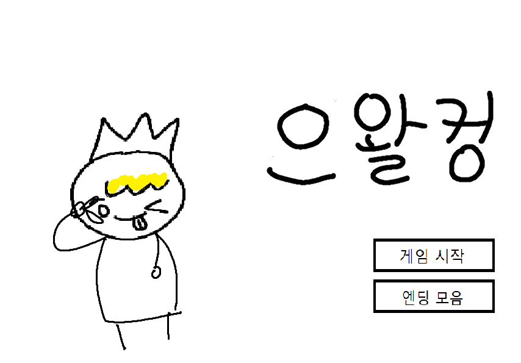
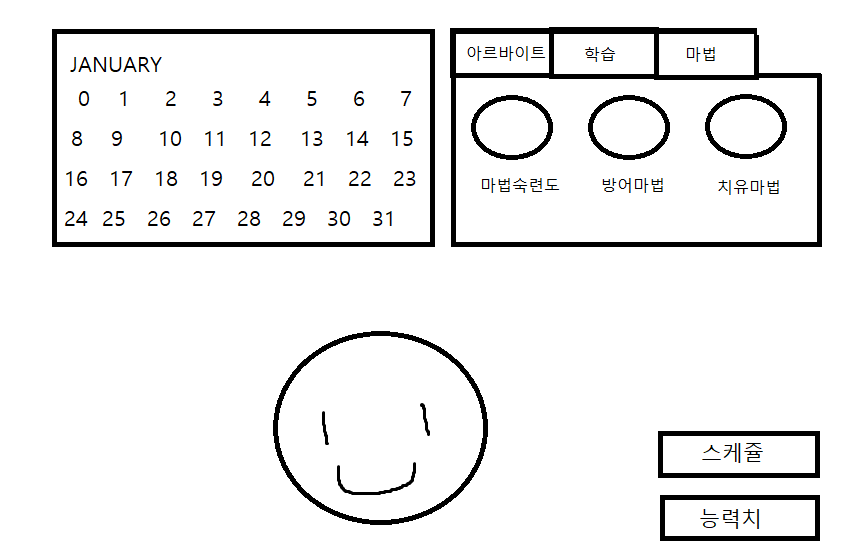

# [컨셉]
## 메인컨셉 : 스토리(story)
- 육성 시뮬레이션
- 스토리 위주의 게임
- 예지몽을 꾼 주인공이 왕국과 포로가 될 언니를 전쟁으로부터 구하는 스토리

## 서브컨셉1 : 판타지(fantasy)
- 현실에서 일어날 수 없는 마법, 변신 이라는 요소를 사용
- 동물이 인간으로 변신

## 서브컨셉2 : 관계성(relationship)
- 게임 진행 도중 만나는 NPC들과 관계성을 쌓아 능력치를 얻음

## 서브컨셉3 : 성장
- 선택을 통해 경험을 쌓아 주인공이 성장

## 서브컨셉4 : 다양함
- 주인공의 모습의 변화에 따라 여러가지 상황에 다양한 방법으로 게임 진행 가능
- 같은 엔딩 방식(bad, happy)이더라도 여러가지 다른 상황의 엔딩 스토리가 존재

## 서브컨셉5 : 전략
- 선택하는 변신폼에 따라 이벤트 결과가 달라짐
- 일정 분기 전에 올린 능력치에 따라 엔딩 조건이 갈림

  

# [관련이미지 & 동영상]
## 이미지
-메인화면

-스케쥴화면

## 동영상
- 관련 다른 게임
(https://www.youtube.com/watch?time_continue=1&v=QSSJmJLB4gI&feature=emb_title)
