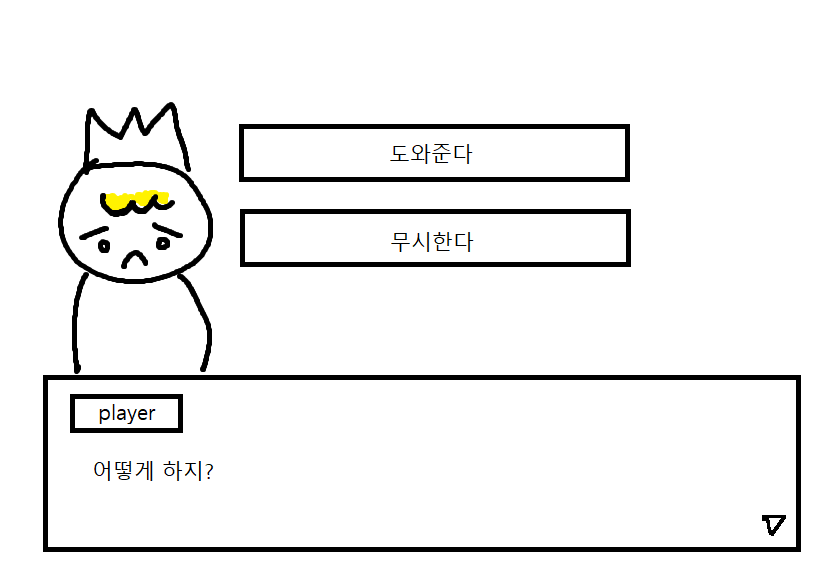
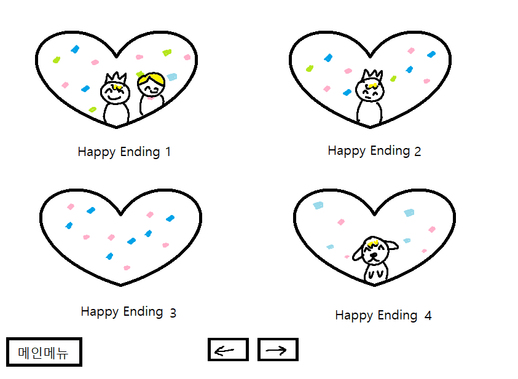
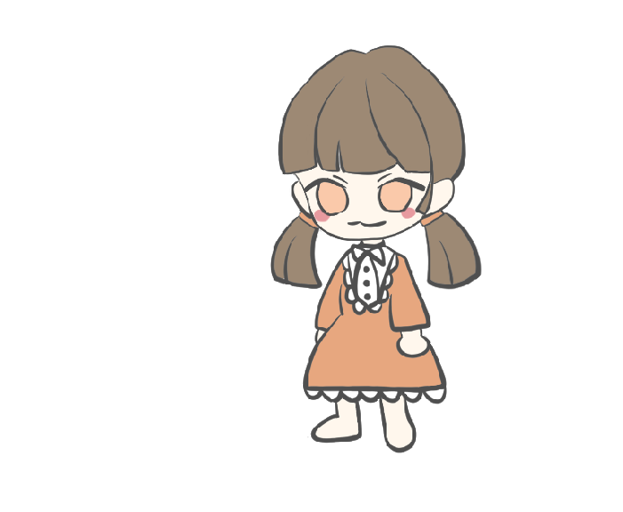
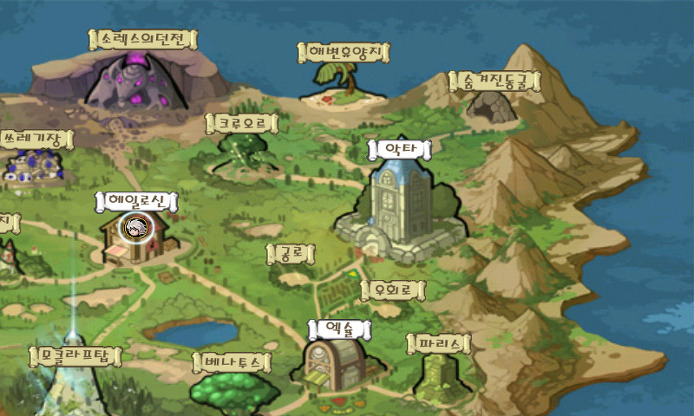

### 1. [[컨셉]](#컨셉)
### 2. [[관련이미지 & 동영상]](#관련이미지--동영상)
### 3. [[대표이미지]](#대표이미지)
### 4. [[<으왈컹>의 구성요소]](#으왈컹의-구성요소)
### 5. [[게임 시스템 디자인]](#게임-시스템-디자인)
### 5-1. [1. 게임 오브젝트 분해(구성 요소 분석)](#1-게임-오브젝트-분해--구성-요소-분석)
### 5-2.
### 5-3.
### 5-4.
### 5-5.
### 5-6.
### 5-7.

# [컨셉]
## 메인컨셉 : 스토리(story)
- 육성 시뮬레이션
- 스토리 위주의 게임
- 예지몽을 꾼 주인공이 왕국과 포로가 될 언니를 전쟁으로부터 구하는 스토리

## 서브컨셉1 : 판타지(fantasy)
- 현실에서 일어날 수 없는 마법, 변신 이라는 요소를 사용
- 동물이 인간으로 변신

## 서브컨셉2 : 관계성(relationship)
- 게임 진행 도중 만나는 NPC들과 관계성을 쌓아 능력치를 얻음

## 서브컨셉3 : 성장
- 선택을 통해 경험을 쌓아 주인공이 성장

## 서브컨셉4 : 다양함
- 주인공의 모습의 변화에 따라 여러가지 상황에 다양한 방법으로 게임 진행 가능
- 같은 엔딩 방식(bad, happy)이더라도 여러가지 다른 상황의 엔딩 스토리가 존재

## 서브컨셉5 : 전략
- 선택하는 변신폼에 따라 이벤트 결과가 달라짐
- 일정 분기 전에 올린 능력치에 따라 엔딩 조건이 갈림
  
  

# [관련이미지 & 동영상]
## <이미지>

## <동영상>
- 관련 다른 게임
(https://www.youtube.com/watch?time_continue=1&v=QSSJmJLB4gI&feature=emb_title)
  
  

# [대표이미지]
- 메인화면

 

- 스케쥴화면

 

- 선택창화면

 

- 엔딩모음화면

 
  
  

# [<으왈컹>의 구성요소]
## <스토리>
#### 주인공은 개 왕국의 공주님. 마법 능력을 가지고 태어남.
#### 그러나 마법 능력이 점점 약해져 평범한 사람과 같아짐.
 

#### 어느날 보물창고에서 이상하게 끌리는 보석을 발견하고 그것을 만졌는데 빛이 쏟아져나옴. 그리고 마력이 돌아온 것을 느낌.
#### 그날 밤 주인공은 꿈을 꾸게 되는데, 1년 후 이웃나라와의 전쟁으로 왕국이 패배하는 꿈이었음. 설상가상으로 사랑하는 언니가 포로로 잡혀감.
 

#### 꿈에서 꺤 주인공은 이것이 예지몽임을 깨닫고 이 사실을 모두에게 알리려고 시도함.
#### 하지만 관련된 말을 꺼내려고만 하면 목소리가 나오지 않아 실패함.
 

#### 도움을 받을 수 없다는 것을 받아들인 주인공은 자신의 힘으로 왕국과 포로가 된 언니를 전쟁으로부터 구하기로 결심함.
  

## <메커니즘>
#### 주인공은 매주 기술을 올려주는 수업을 들어야 함.
#### 주인공이 배운 기술들에 따라, 게임을 진행하는 동안 나오는 선택지가 변함.
#### 어떤 기술을 배우냐에 따라 볼 수 없는 이벤트도 있음.
 

#### 수업을 하면 스트레스가 일정치 쌓임.
#### 스트레스 수치가 일정수준 이상 올라가면 캐릭터가 수업을 제대로 수행할 수 없음.
#### 스트레스 관리에 주의!
 

#### npc 호감도는 주인공이 배울 기술이나 이벤트에 영향을 줌.
#### npc에 따라 기술을 배울 때 주는 보너스나 페널티가 바뀜.
#### 친해진 npc에 따라 열리는 선택지가 있음.
 

#### 기술목록 -> ( 개 능력 / 신체 능력 / 마법 능력 / 지식 / 신성력 )
#### 일주일에 2개의 기술을 배울 수 있음. 주말을 제외한 하루마다 배우려 하는 기술을 10포인트씩 획득.(제한 1000)
 

#### 주말에는 마을에 방문해서 npc의 호감도를 올리거나 능력치를 올릴 수 있음.
#### 특정 주차에는 숨겨진 이벤트 스토리를 볼 수도 있음. / 토,일 오전오후 4번
 

#### 이야기를 진행하면서, 시스템 안내메세지창이 왼쪽 상단에 나타날 때가 있음.
#### 이 안내메세지들은 장면 이면에 무슨 일이 일어나는지 알려줌.(능력치 or 호감도 수치의 변화)
 

#### 또 다른 메세지는 플레이어가 이전에 배운 기술에 의해 이야기가 바뀔 때 보이게 됨.
#### 만약 실패했다는 메세지가 나오면, 해당 기술이 요구 수치에 못 미쳤기 때문에 숨겨진 선택지를 지나치게 된다는 뜻.
#### 예를 들어 산책을 하고 있었는데 도둑을 발견함 -> 경비병에게 신고한다, 도망친다, (쫓아간다) <- 숨겨진 선택지
#### [민첩성 < 30이면 안내창에 민첩성 -> 실패 라는 메세지가 뜸] 
 

#### 이러한 메세지들은 숨겨진 다른 선택지들을 알아내고 다음 회차 플레이에 도움을 줄 수 있음.
  

## <미적요소>
### <디자인>
- #### 능력치가 일정치에 도달하면 해당 능력치에 관련된 의상이 오픈
 

### <음향>
- #### 시스템 메세지가 뜰 때 알림음이 출력됨
- #### 장소에 바뀌거나 이벤트가 발생할 때 BGM이 바뀜
- #### 엔딩의 종류에 따라서 BGM이 바뀜
 

# [게임 시스템 디자인]

## 1. 게임 오브젝트 분해(구성 요소 분석)

|연번|오브젝트 이름|오브젝트 이미지|  
|:-----:|:----:|:-----:|  
|1|플레이어 캐릭터||  
|2|마을||  
|3|선택지|이미지|  
|4|스케쥴|이미지|  
|5|아이템|이미지|  

## 2. 파라미터(속성) 뽑아 보기
### 1) 오브젝트 이름 : 플레이어 캐릭터

|속성|속성값|설명|비고|  
|:-----:|:----:|:-----:|:----:|  
|이름|시트린|||  
|나이|15세|||  
|스트레스|0~100|스케쥴 수행 시 스트레스 수치 +n. 스트레스가 m이상 쌓이면 스케쥴 수행 불가능||  
|능력치|0~1000|개 능력 / 신체 능력 / 마법 능력 / 지식 / 신성력||  
|NPC호감도|0~100|각 NPC들의 호감도 y이상 상승 시 능력시 z 상승, 새로운 선택지 활성화||  
 

### 2) 오브젝트 이름 : 마을

|속성|속성값|설명|비고|  
|:-----:|:----:|:-----:|:----:|  
|상점||스트레스 아이템 구매 가능||  
|성당||(일정 시간 이상 기도 시) 특별한 아이템 획득 가능||  
 

### 3) 오브젝트 이름 : 선택지

|속성|속성값|설명|비고|  
|:-----:|:----:|:-----:|:----:|  
|기본 선택지||스토리 진행 시 기본적으로 활성화된 선택지||  
|능력치 선택지||요구 능력치가 일정 수치 이상일 시 활성화되는 선택지||  
|NPC 선택지||관련 NPC와의 호감도가 일정 수치 이상일 시 활성화되는 선택지||  
 

### 4) 오브젝트 이름 : 스케쥴

|속성|속성값|설명|비고|  
|:-----:|:----:|:-----:|:----:|  
|학습|미정|능력치 상승 가능||  
|아르바이트||아이템 구매, 학습에 필요한 골드 획득 가능||  
 

### 5) 오브젝트 이름 : 아이템

|속성|속성값|설명|비고|  
|:-----:|:----:|:-----:|:----:|  
|옷|강아지 코스튬 / 기사옷 / 마법사옷 / 학자복 / 사제복|능력치가 특정 수치에 도달하면 그 능력치에 관련된 의상이 오픈됨||  
|스트레스 아이템|음식|스트레스 아이템은 상점에서 구매 가능. 아이템을 사용해 스트레스 조절 가능.  쿠키-3, 케이크-5, 스테이크-100 감소||  
|능력치 아이템|생일선물|아이템 소지 시 능력치 변화.  개 능력->뼈다귀+10, 신체능력->검+10, 마법능력->수정구+10, 지식->책+10, 신성력->십자가+10 증가||  
 

## 3. 행동 뽑아 보기
### 2) 오브젝트 이름 : 마을

|행동|설명|  
|:-----:|:----:|  
|상점||아이템 구매 가능|  
|성당||가나|  
 

## 4. 상태 뽑아 보기
 

## 5. 플레이어 캐릭터 속성(파라미터)
 

## 6. 게임의 규칙
 

## 7. 게임에서 사용될 공식
